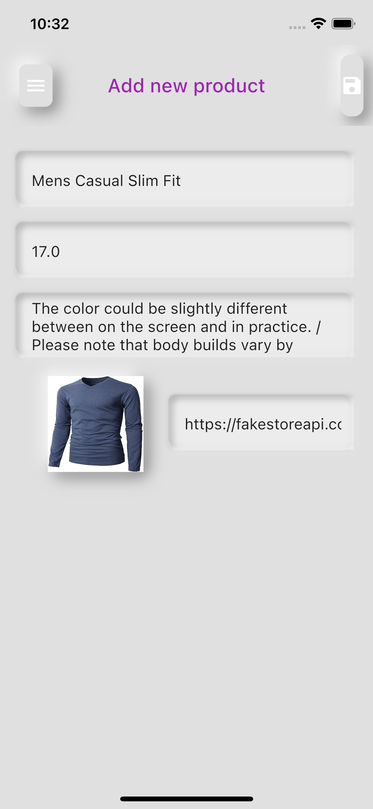

Helps to turn some popular widgets into Neumorphism style.

## Features

* NeumorphicCard: a card with Neumorphism look and feel
* NeumorphicButton: implements tap down and release button effects. Also has onTap listener.
* NeumorphicTextInputField: builds TextInputField with emboss effect.

## Getting started
To use this package, add 'neumorphic_widget' as a dependency in your `pubspec.yaml` file.

## Usage
### Screenshots
  
### Examples
Here are small examples that show you how to use `NeumorphicCard`

```dart
NeumorphicCard(
              shadowBlur: 15,
              backgroundColor: kBackgroundColor,
              child: Card(
                color: kBackgroundColor,
                elevation: 0,
                child: Container(...),
              ),
            ),
```

Use `NeumorphicButton`
```dart
NeumorphicButton(
              borderRadius: BorderRadius.circular(8.0),
              width: MediaQuery.of(context).size.width * 0.5,
              height: 40,
              onPressed: _submit,
              child: Text('LOGIN'),
            ),
```
`NeumorphicText`

```dart
NeumorphicTextInputField(
                          textFormField: TextFormField(
                            onSaved: (_) {},
                            decoration: buildNeumorphicInputDecoration(
                                'Username'),
                          ),
                        ),
```

## Additional information
In `NeumorphicTextInputField`, you can apply `buildNeumorphicInputDecoration(String hintText)` for child widget `TextFormField`'s decoration to make a better look.
